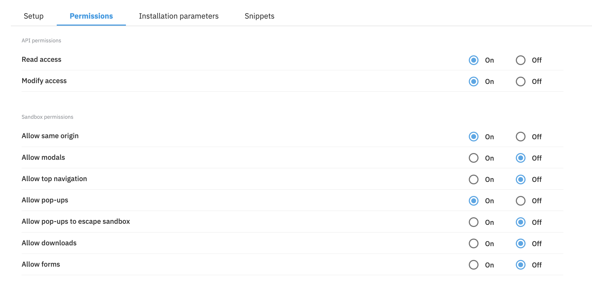

# dc-extension-ai-image-caption

> AI powered image caption text field for use in [Amplience Dynamic Content](https://amplience.com/dynamic-content)

Note: This extension is in **BETA** for use as is without support or warranty

This extension uses artificial intelligence to automatically generate image captions for use as alternative text, which is read aloud by screen readers used by visually impaired users.

Users can choose to manually populate the caption or use the automatically generated caption.

## How to install

### Register Extension

This extension needs to be [registered](https://amplience.com/docs/development/registeringextensions.html) against a Hub with in the Dynamic Content application (Developer -> Extensions).


- Category: Content Field
- Label: AI Image Caption
- Name: ai-image-caption _(needs to be unique with the Hub)_
- URL: [https://ai-image-caption.extensions.content.amplience.net](https://ai-image-caption.extensions.content.amplience.net)
- Description: _(can be left blank, if you wish)_
- Initial height: 200

#### Permissions



### Assign the extension to schema

To use the extension, you simply need to add an image field and a string field, which represents the caption, to your content type schema.

The string field should be configured to use the extension along with an `image` param, which informs the extension which image property it should be linked to.

The `image` param should be a valid [JSON pointer](https://datatracker.ietf.org/doc/html/rfc6901).

```json
{
  "image": {
    "title": "Hero Image",
    "allOf": [
      {
        "$ref": "http://bigcontent.io/cms/schema/v1/core#/definitions/image-link"
      }
    ]
  },
  "imageCaption": {
    "title": "Hero Alt Text",
    "type": "string",
    "minLength": 0,
    "maxLength": 200,
    "ui:extension": {
      "name": "ai-image-caption",
      "params": {
        "image": "/image"
      }
    }
  }
}
```

## Configuration

You can customize the extension by providing "params" in your installation parameters or inside the content type schema.

### Image property

The extension must be linked to an image property using a [JSON pointer](https://datatracker.ietf.org/doc/html/rfc6901). When a caption is requested, the extension will use the image assigned to this property as the input.

```json
{
  "image": "/pointer/to/image"
}
```

### Auto caption

If enabled, the extension will automatically generate a caption when the image property is populated instead of requiring the user to manually press the caption button.

```json
{
  "autoCaption": true
}
```

## Limitations

- 50 caption limit per day per organization
- This extension is only compatible with hubs that are linked to an organization. Accounts that have not yet [migrated](https://amplience.com/developers/docs/knowledge-center/faqs/account/) from legacy permissions will not see the AI caption feature.
- This extension is in **BETA** for use as is without support or warranty

## How to run locally

Extension:

- `npm run install`
- `npm run build`
- `npm run start`

Storybook:

- `npm run storybook`
